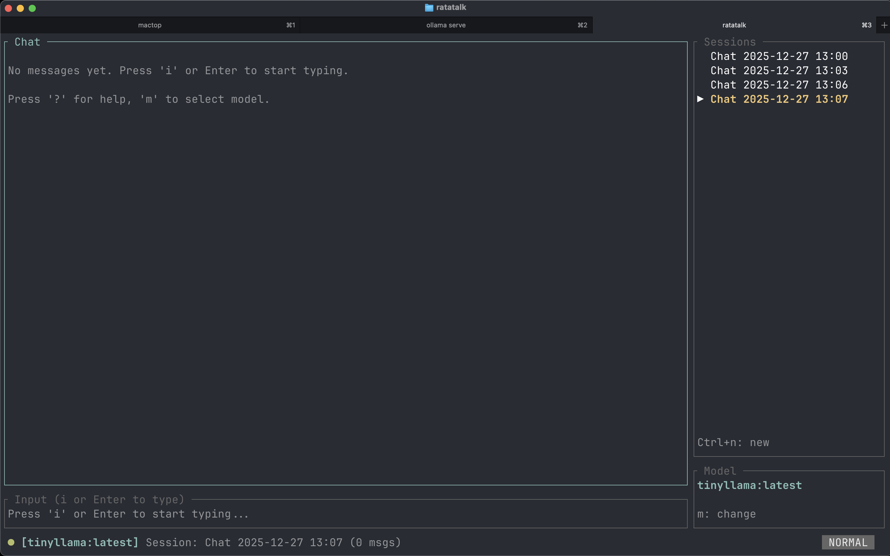

# Ratatalk 🦀💬

A terminal chat client for [Ollama](https://ollama.com), built with Rust and [ratatui](https://ratatui.rs).


## Features

- 🚀 **Fast & Responsive**: Non-blocking UI with streamed responses
- 💬 **Multi-Session**: Manage multiple named chat conversations
- 💾 **Persistent**: Sessions auto-save across restarts
- ⌨️ **Keyboard-Driven**: Vim-inspired keybindings
- 🖱️ **Mouse Support**: Click to switch sessions, scroll chat, and navigate
- 🎨 **Beautiful TUI**: Clean, modern terminal interface
- ⚙️ **Configurable**: TOML-based configuration

## Installation

### Prerequisites

- [Rust](https://rustup.rs/) (stable)
- [Ollama](https://ollama.com/) running locally

### Install via crates.io (recommended)

The easiest way to get started is to install Ratatalk as a global CLI tool:

```bash
cargo install ratatalk
```

This downloads the latest version from [crates.io](https://crates.io/crates/ratatalk) and installs it to your `~/.cargo/bin` directory. After installation, `ratatalk` will be available in your `PATH`, so you can run it from any directory:

```bash
ratatalk
```

### Screenshot from the app:




### Run from source (for development)

If you want to hack on Ratatalk or try the latest features from the repository:

```bash
git clone https://github.com/mohammad-albarham/ratatalk.git
cd ratatalk
```

Then run it in development mode:

```bash
cargo run
```

Or with optimizations (recommended for better performance):

```bash
cargo run --release
```

### Optional: Handy shell alias

If you frequently run from source, you can add a shell alias to `~/.bashrc` or `~/.zshrc`:

```bash
alias rt='cargo run --release'
```

Reload your shell configuration to apply it:

```bash
source ~/.zshrc  # or source ~/.bashrc
```

Now you can simply type `rt` to run Ratatalk:

```bash
rt
```

## Usage

### Running Ollama

Ratatalk expects a local Ollama server running on `http://127.0.0.1:11434` (the default). Start Ollama in a terminal:

```bash
ollama serve
```

### Starting Ratatalk

In another terminal, run Ratatalk:

```bash
ratatalk
```

If you installed via crates.io, just use `ratatalk`. If you're running from source with the shell alias, use `rt`.

## Keybindings

### General
| Key | Action |
|-----|--------|
| `q` / `Ctrl+c` | Quit |
| `?` | Toggle help |
| `Ctrl+r` | Refresh models |

### Navigation
| Key | Action |
|-----|--------|
| `Tab` | Next session |
| `Shift+Tab` | Previous session |
| `Ctrl+n` | New session |
| `Ctrl+w` | Delete session |
| `m` | Select model |

### Chat
| Key | Action |
|-----|--------|
| `i` / `Enter` | Start typing |
| `Esc` | Stop typing |
| `Enter` | Send message (while typing) |

### Scrolling
| Key | Action |
|-----|--------|
| `j` / `↓` | Scroll down |
| `k` / `↑` | Scroll up |
| `Ctrl+d` | Page down |
| `Ctrl+u` | Page up |
| `g` | Scroll to top |
| `G` | Scroll to bottom |

### Input Editing
| Key | Action |
|-----|--------|
| `Ctrl+a` | Move to start of line |
| `Ctrl+e` | Move to end of line |
| `Ctrl+u` | Clear input |
| `Ctrl+w` | Delete word |

## Configuration

Configuration is stored at `~/.config/ratatalk/config.toml`:

```toml
[server]
host = "http://127.0.0.1:11434"
timeout_secs = 30

[model]
default_model = "llama3.2:latest"
temperature = 0.7
top_k = 40
top_p = 0.9
max_tokens = 0  # 0 = unlimited

[ui]
show_timestamps = true
show_token_count = true
sidebar_width = 30
mouse_support = true
tick_rate_ms = 100

[keybindings]
vim_mode = false
```

## Data Storage

- **Config**: `~/.config/ratatalk/config.toml`
- **Sessions**: `~/.local/share/ratatalk/sessions.json`
- **Logs**: `~/.config/ratatalk/ratatalk.log`

## Architecture

```
src/
├── main.rs           # Entry point, terminal setup, main loop
├── app.rs            # Application state, events, actions
├── config.rs         # Configuration management
├── error.rs          # Error types
├── events.rs         # Input handling, keybindings
├── persistence.rs    # Session save/load
├── ollama/
│   ├── mod.rs        # Module exports
│   ├── client.rs     # HTTP client
│   └── types.rs      # API types
└── ui/
    ├── mod.rs        # UI module, colors, styles
    ├── layout.rs     # Screen layout
    ├── chat.rs       # Chat area rendering
    ├── input.rs      # Input box rendering
    ├── sidebar.rs    # Session/model sidebar
    └── popup.rs      # Modal dialogs
```

## Roadmap

### MVP ✅
- [x] Connect to local Ollama
- [x] List available models
- [x] Chat with streaming responses
- [x] Multiple chat sessions
- [x] Persistent config & sessions
- [x] Basic keybindings

### Future
- [ ] System prompts per session
- [ ] Adjustable model parameters per session
- [ ] SQLite backend for history
- [ ] Export chat to Markdown
- [ ] Token/latency statistics
- [ ] Vim-style keybindings
- [ ] Search within chat
- [ ] RAG support with local files
- [ ] Image/multimodal support

## Changelog

### v0.1.2 (2026-01-07)

**🖱️ Mouse Navigation Support** — Fixes [#1](https://github.com/mohammad-albarham/ratatalk/issues/1)

- **Click to switch sessions**: Click any session in the sidebar to switch to it
- **Click to focus input**: Click the input area to enter editing mode
- **Click model box**: Click the model info box to open the model selector
- **Scroll with mouse wheel**: Scroll through chat history using the mouse wheel
- **Click to dismiss popups**: Click anywhere to close help, model selector, or delete confirmation popups
- Configuration option `mouse_support` to enable/disable (enabled by default)

**Commit**: [`99ba6db`](https://github.com/mohammad-albarham/ratatalk/commit/99ba6db)

---

### v0.1.1 (2026-01-05)

- Initial release on crates.io
- Chat with local Ollama models
- Multiple persistent sessions
- Vim-style keybindings
- Streaming responses
- TOML configuration

## Contributing

Contributions are welcome! Please feel free to submit a Pull Request.

## License

MIT License - see [LICENSE](LICENSE) for details.

## Acknowledgments

- [Ollama](https://ollama.com/) for the excellent local LLM server
- [ratatui](https://ratatui.rs/) for the amazing TUI framework
- [oterm](https://github.com/ggozad/oterm) for inspiration
